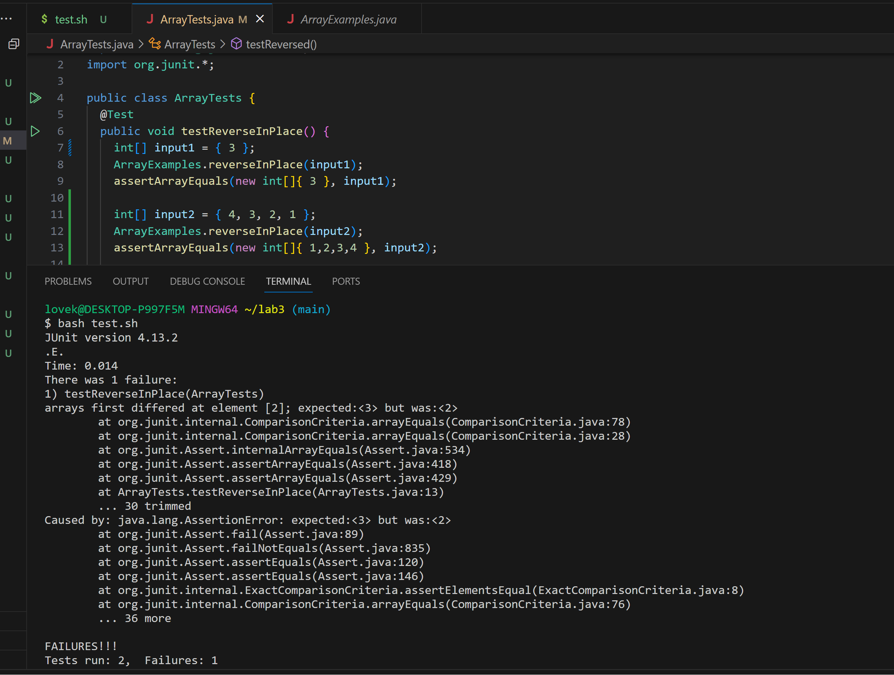

# CSE15L
## Lab 3

### Part 1
+ A failure-inducing input
  ```ruby
  @Test 
  public void testReverseInPlace() {
    int[] input2 = { 4, 3, 2, 1 }; 
    ArrayExamples.reverseInPlace(input2);
    assertArrayEquals(new int[]{ 1,2,3,4 }, input2);
  }
  ```
+ An input that doesn’t induce a failure
  ```ruby
  @Test 
  public void testReverseInPlace() {
    int[] input1 = { 3 }; 
    ArrayExamples.reverseInPlace(input1);
    assertArrayEquals(new int[]{ 3 }, input1);
  }
  ```
+ The symptom
  
+ The bug

  Before change
  ```ruby
  // Changes the input array to be in reversed order
  static void reverseInPlace(int[] arr) {
    for(int i = 0; i < arr.length; i += 1) {
      arr[i] = arr[arr.length - i - 1];
    }
  }
  ```
  After Change
  ```ruby
  // Changes the input array to be in reversed order
  static void reverseInPlace(int[] arr) {
    for(int i = 0; i < arr.length/2; i += 1) {
      int temp = arr[i];
      arr[i] = arr[arr.length - i - 1];
      arr[arr.length - 1 - i]= temp;
    }
  }
  ```
  Brief Explanation

  The original code bug happens in the for loop, which will iterate through all the array elements, but after change first half of the arr[i] with arr[arr.length - i - 1], it will change the other half of the arr[i] with arr[arr.length - i - 1], which is the same value as itselves, since we change them at previous iterations. This cause the bugs

  After fixing, I change the for loop only iterate half times as the length of the array, and in every loop I store arr[i] value in "temp" variable and change it to arr[arr.length - i - 1] and then change arr[arr.length - i - 1] value to "temp" which is previous arr[i]. This complete the reverseInPlace

### Part 2

I choose command grep, and option -i,  

+ -i

  This will ignore case distinctions in patterns and input data, so that it will output every matching lines in the file.

  It is useful becasue, by defautlt, grep command does not ignore case distinctions in patterns and input data. So without this option we need to input more  commands.

    - Example on file:
      ```
      lovek@DESKTOP-P997F5M MINGW64 ~/docsearch (main)
      $ grep -i " as "  technical/plos/pmed.0020278.txt
          disease are those who don't understand it or those who benefit from it. As a physician,
          genetic relatives, primates have failed as research models virtually whenever they have
          As a partial list of failures, allow me to submit the notorious forced smoking
      ```
      The output shows everty line contains " as " in the file. 

    - Exmaple on directory:
      ```
      lovek@DESKTOP-P997F5M MINGW64 ~/docsearch (main)
      $ grep -i " as "  technical/plos/*
      technical/plos/journal.pbio.0020001.txt:        is a statistical bias on the part of the SCI as a bibliometric database, since it
      technical/plos/journal.pbio.0020001.txt:        developing worlds actually remaining unchanged or even increasing, as Mr. Annan has
      technical/plos/journal.pbio.0020001.txt:        well as data compiled by the Red Iberoamericana de Indicadores de Ciencia y Tecnología       
      technical/plos/journal.pbio.0020001.txt:        focusing on the Americas as a case study. Not surprisingly, there was a huge disparity in    
      technical/plos/journal.pbio.0020001.txt:        lion's share (84.2%), followed by Canada (10.35%). Latin America as a whole contributed      
      technical/plos/journal.pbio.0020001.txt:        1990 as a comparison, revealed that scientific publishing in Latin America increased the     
      technical/plos/journal.pbio.0020001.txt:        Other relative indicators of scientific productivity, such as the number of publications     
      technical/plos/journal.pbio.0020001.txt:        demonstrate that such developing regions as Latin America are making substantial
      technical/plos/journal.pbio.0020001.txt:        itself as compared with the GDP of Latin America as a whole. In fact, Albornoz (2001)        
      technical/plos/journal.pbio.0020001.txt:        concluded that, as a group, Latin America could afford to invest a much higher proportion    
      technical/plos/journal.pbio.0020001.txt:        rate as well as in financial investment in science and technology. Some countries have       
      technical/plos/journal.pbio.0020001.txt:        United States (1.5) and even Canada (3.3) (RICYT 2002). Other countries, such as Costa       
      technical/plos/journal.pbio.0020001.txt:        which were publishing just as well at the beginning of the decade. A potentially more        
      technical/plos/journal.pbio.0020001.txt:        which are mutually exclusive. It is possible that publishing in international journals as a  
      technical/plos/journal.pbio.0020001.txt:        What, exactly, is the relative impact of such developing regions as Latin America on the     
      technical/plos/journal.pbio.0020001.txt:        data as contributions to the top 10 ecological journals (impact factors 10.51–3.31) versus   
      technical/plos/journal.pbio.0020001.txt:        twice as many publications to journals in the second category (8% in the top 11–20 compared  
      technical/plos/journal.pbio.0020001.txt:        regions as Latin America are falling short of reaching the top journals. In contrast, the
      (a lot of lines)  
      ```
      Output shows all file names and all lines contains " as " in the diretory techical/plos. 
+ -v

  Command with option -v will output those non matching lines. 
  
  This option is useful because we can select those line without strings we don't need.

    - Example on file:
      ```
      lovek@DESKTOP-P997F5M MINGW64 ~/docsearch (main)
      $ grep -v ","  technical/plos/pmed.0020278.txt


          The only people who don't know in 2005 that animal research is irrelevant for human
          been used.
          of a quarter-century of primate research on AIDS to provide any useful insights; the false
          himself); the failure of primate studies to improve risks for birth defects and premature
          births; and the failure of monkey studies to identify nonsteroidal anti-inflammatory drug
          cardiovascular risk [1].
          The
          PLoS Medicine editors state in hopeful language that the Lassa fever
          individuals [4].
          to identify even one useful AIDS drug from primate studies. Genetic and physiological
          applicable to humans. The Human Genome Project [5] tells us that there is sufficient
          genetic diversity among humans that pharmacogenetic and pharmacogenomic techniques will
          have an increasing role in overcoming problems related to polymorphisms and other
          PLoS Medicine is now promoting monkey research?
          I am very disappointed that
          PLoS Medicine has regressed to reporting animal research. It is
    
      ```
      The output shows every line that doesn't include "," which is my input.

    - Exmaple on directory:
      ```
      lovek@DESKTOP-P997F5M MINGW64 ~/docsearch (main)
      $ grep -v "historical" technical/plos/*
      technical/plos/journal.pbio.0020001.txt:
      technical/plos/journal.pbio.0020001.txt:
      technical/plos/journal.pbio.0020001.txt:
      technical/plos/journal.pbio.0020001.txt:
      technical/plos/journal.pbio.0020001.txt:
      technical/plos/journal.pbio.0020001.txt:        Kofi Annan, the Secretary-General of the United Nations, recently called attention to        
      technical/plos/journal.pbio.0020001.txt:        the clear inequalities in science between developing and developed countries and to the      
      technical/plos/journal.pbio.0020001.txt:        challenges of building bridges across these gaps that should bring the United Nations and    
      technical/plos/journal.pbio.0020001.txt:        the world scientific community closer to each other (Annan 2003). Mr. Annan stressed the     
      technical/plos/journal.pbio.0020001.txt:        importance of reducing the inequalities in science between developed and developing
      technical/plos/journal.pbio.0020001.txt:        countries, asserting that “This unbalanced distribution of scientific activity generates     
      technical/plos/journal.pbio.0020001.txt:        serious problems not only for the scientific community in the developing countries, but for  
      technical/plos/journal.pbio.0020001.txt:        development itself.” Indeed, Mr. Annan's sentiments have also been echoed recently by 
      (a lot of lines)       
      ```
      Output shows all files and all lines that not contains "historical" in the directory of technical/plos.
    
+ -l

      This option will returen all filename that contain "pattern", we can enter multiple filenames and specific directory. like grep option pattern filename filename filename directory/*.

      This is useful becasue, we can search for specific files that contains the elements we need.
  
    - Example on file:
      ```
      lovek@DESKTOP-P997F5M MINGW64 ~/docsearch (main)
      $ grep -l "historical" technical/plos/pmed.0020281.txt technical/plos/pmed.0020278.txt
      technical/plos/pmed.0020278.txt
      ```
      Output only shows the file contains "historical".
      
    
    - Exmaple on directory:
      ```
      lovek@DESKTOP-P997F5M MINGW64 ~/docsearch (main)
      $ grep -l "historical" technical/plos/*
      technical/plos/journal.pbio.0020064.txt
      technical/plos/journal.pbio.0020112.txt
      technical/plos/journal.pbio.0020263.txt
      technical/plos/journal.pbio.0020347.txt
      technical/plos/journal.pbio.0020406.txt
      technical/plos/journal.pbio.0020420.txt
      technical/plos/journal.pbio.0030062.txt
      technical/plos/journal.pbio.0030136.txt
      technical/plos/pmed.0020009.txt
      technical/plos/pmed.0020059.txt
      technical/plos/pmed.0020060.txt
      technical/plos/pmed.0020065.txt
      technical/plos/pmed.0020191.txt
      technical/plos/pmed.0020192.txt
      technical/plos/pmed.0020212.txt
      technical/plos/pmed.0020278.txt
      ```
      The output shows every file name that contains "historical" in directory technical/plos.

+ -x

    This option will output the those matches that exactly mathc the wohle line.

    This is useful when we want to make sure that our pattern matches a whole line and not just a substring.
    
    - Example on file:
      ```
      lovek@DESKTOP-P997F5M MINGW64 ~/docsearch (main)
      $ grep -x "        professional biologists ever since the invention of the microscope. But these days, diatoms" technical/plos/journal.pbio.0
      020306.txt
              professional biologists ever since the invention of the microscope. But these days, diatoms
      ```
      This output shows the line in file exactly same as the pattern inputted in the command.
    

    - Exmaple on directory:
      ```
      lovek@DESKTOP-P997F5M MINGW64 ~/docsearch (main)
      $ grep -x "        a" technical/plos/*
      technical/plos/journal.pbio.0020302.txt:        a
      technical/plos/journal.pbio.0020430.txt:        a
      technical/plos/journal.pbio.0030065.txt:        a
      technical/plos/pmed.0010030.txt:        a
      technical/plos/pmed.0010056.txt:        a
      technical/plos/pmed.0020090.txt:        a
      ```
      I randomly add "        a" in some file this code outputs the all file name that cotain identical string "        a".
      


